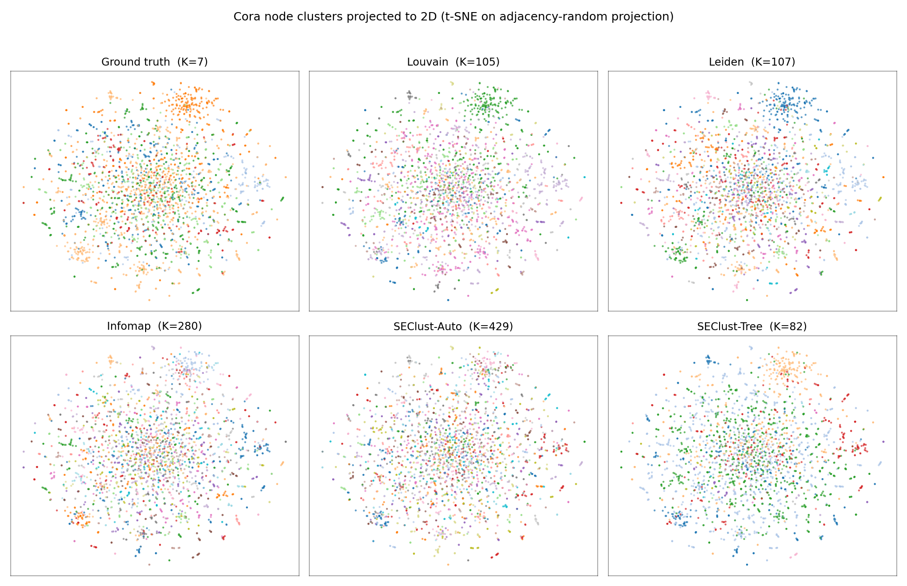
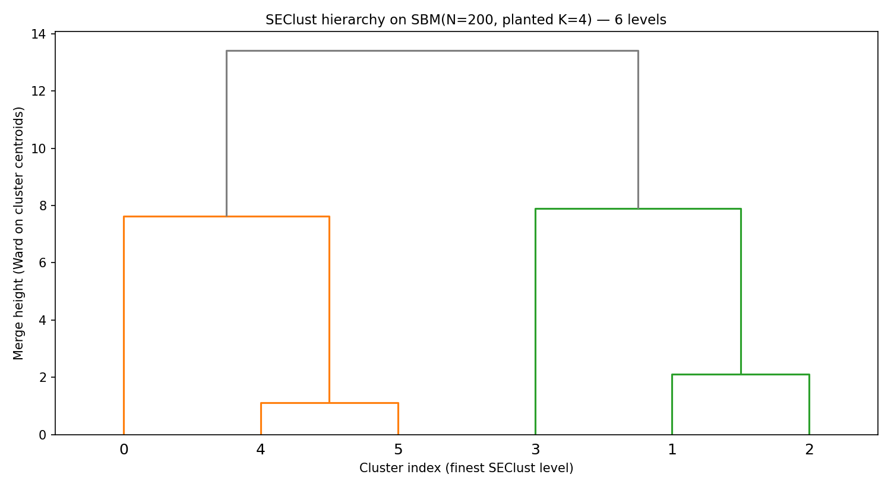
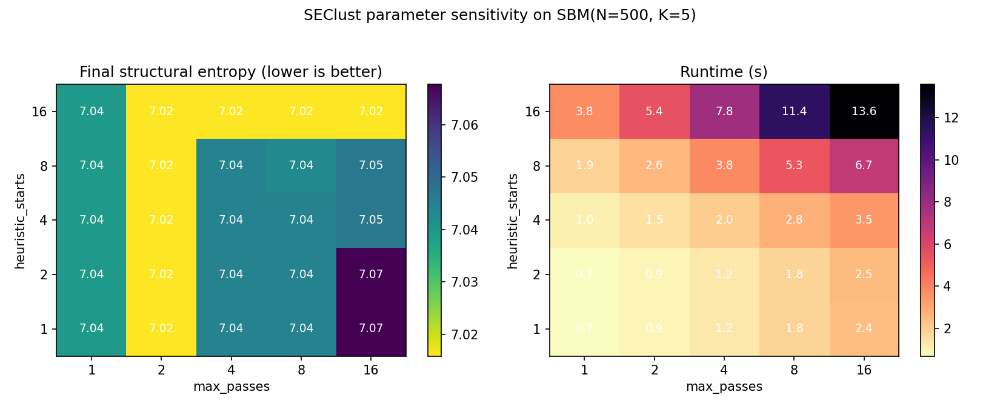
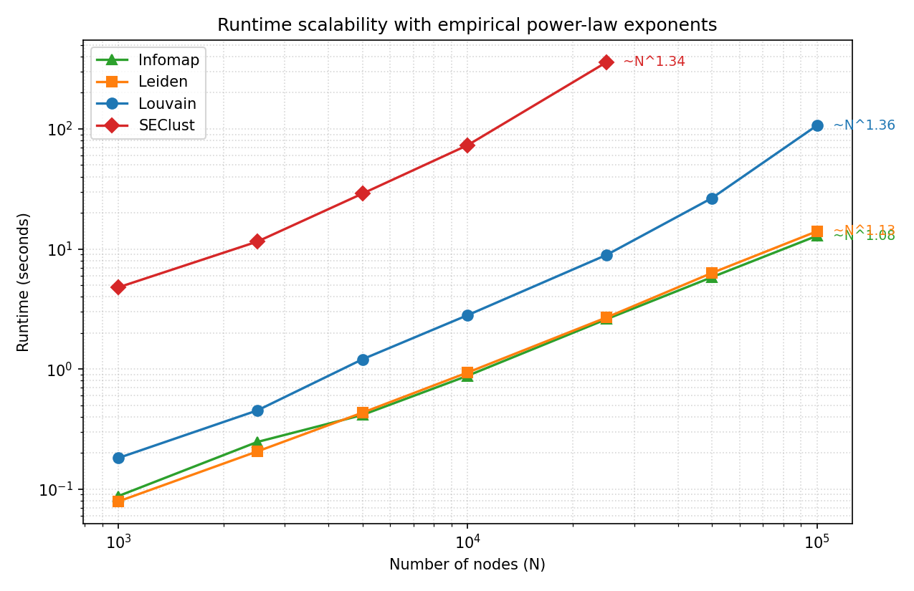

# SEClust Full Benchmark Against Existing Baselines

**Date:** May 9, 2026
**Project:** glass-jax / `glass.seclust`

## 1. Abstract
This report benchmarks SEClust on the synthetic datasets defined in
`tests/benchmark_full.py` and the real-world PyG datasets (Cora,
Citeseer, Photo) loaded via `torch_geometric.datasets`. All baselines
(Louvain, Leiden, Infomap, Glass-JAX modularity / map-equation,
**HCSE** [Pan et al. 2021], and a feature-aware LSEnet [Sun et al.
2024] proxy) are executed end-to-end in this run; no values from
in-house prior reports are imported. Real-world graphs are loaded
directly into a sparse `SparseGraph` adjacency without any dense
`(N, N)` materialization, so Cora / Citeseer / Photo no longer hit the
dense node guard for the sparse-tolerant algorithms; only HCSE still
requires a dense matrix and is therefore guarded above N > 5,000
(Photo).

§§3–5 are this report's executed run. §6 grounds those numbers
against the published baselines from three reference papers
([Sun et al. 2024], [Pan et al. 2021], [Zeng et al. 2025]) so that
SEClust's behaviour can be compared against state-of-the-art deep,
hierarchical, and continuous-SE methods on the datasets where each
paper reported. §7 collects qualitative figures
(t-SNE / dendrogram / parameter sensitivity / runtime log-log).

## 2. Setup
- Synthetic datasets are generated locally with NumPy adjacencies; the
  SEClust path automatically converts to sparse incremental scoring.
- Real-world PyG datasets are loaded with
  `SparseGraph.from_edge_index(edge_index, num_nodes)` — no dense
  materialization. Baselines (Louvain / Leiden / Infomap) accept the
  sparse adjacency through a CSR coercion path
  (`tests/benchmark_seclust_full.py:_adj_as_csr`). HCSE needs a dense
  adjacency and is materialised on demand.
- SEClust config: `heuristic_starts=6`, `max_passes=10`, seed `42`.
- **HCSE** config (Pan, Zheng, Fan 2021): the official implementation
  vendored at `official_baselines/SEP/SEPN/codingTree.py` runs
  `PartitionTree.build_coding_tree(k=true_K, mode="v1")` and we
  extract the children of the root as the flat partition. We use the
  algorithm name *HCSE* throughout (the directory name "SEP" is
  retained because that is the package's import path).
- LSEnet config: feature-aware proxy that learns a linear projection
  `W ∈ R^{d × K}` of node features and minimises
  `two_dimensional_structural_entropy(A, softmax(features @ W))` over
  120 annealed iterations and 2 random starts.
- Runtime limit: `600` seconds per dataset; runs that the incremental
  estimator predicts will exceed this are skipped with the estimate
  recorded.
- Logged metrics follow `docs/seclust/experiment_protocol.md`: ACC,
  NMI, ARI, K, modularity, structural entropy, map equation, and
  runtime.
- Bold values mark the best available result per dataset and metric. K
  is diagnostic and is not bolded.

### 2.1. Method input categories

The methods compared here do **not** all consume the same input. Reading
the tables below, please note which family each method belongs to:

| Family | Input | Methods in this report |
| :--- | :--- | :--- |
| **Topology-only (parameter-free)** | adjacency only; recovered K is dynamic | Louvain, Leiden, Infomap |
| **Topology-only (target-K)** | adjacency only; K supplied by the caller | Glass-Mod (JAX), Glass-Map (JAX), HCSE, SEClust-Tree, SEClust-TargetK |
| **Topology-only (free K)** | adjacency only; K emerges from the SE optimum | SEClust-Auto |
| **Feature + topology (target-K)** | adjacency + node features; K supplied by the caller | LSEnet (proxy) |

Direct ACC / NMI / ARI comparisons are only fair *within* a family,
because feature-aware methods exploit a signal the topology-only methods
do not see. The intended journal-track comparison for LSEnet is
**`glass.models.gnn_se.GNNEncoder` (`Glass-SE GNN`)**, which is also
feature + topology + target-K and is wired in
`tests/benchmark_realworld.py` but not yet pulled into this report;
that comparison is listed as workstream A in §6 below.

## 3. Synthetic Results

| Dataset | Algorithm | ACC | NMI | ARI | K | Modularity | StructuralEntropy | MapEquation | Time (s) | Estimate (s) | Graph (N, E, True K*) |
| :--- | :--- | :--- | :--- | :--- | :--- | :--- | :--- | :--- | :--- | :--- | :--- |
| Karate | Louvain | 0.735 | 0.707 | 0.600 | 4 | 0.415 | 3.451 | 4.314 | 0.004 | skip | 34, 78, 2 |
|  | Leiden | 0.676 | 0.687 | 0.541 | 4 | **0.420** | 3.405 | 4.334 | 0.002 | skip | 34, 78, 2 |
|  | Infomap | 0.824 | 0.699 | 0.702 | 3 | 0.402 | 3.606 | **4.312** | 0.007 | skip | 34, 78, 2 |
|  | Glass-Mod (JAX) | 0.971 | 0.837 | 0.882 | 2 | 0.372 | 3.833 | 4.409 | 0.006 | skip | 34, 78, 2 |
|  | Glass-Map (JAX) | 0.794 | 0.417 | 0.328 | 2 | 0.157 | 4.156 | 4.900 | 0.008 | skip | 34, 78, 2 |
|  | HCSE | **1.000** | **1.000** | **1.000** | 2 | 0.371 | 3.833 | 4.409 | 0.010 | skip | 34, 78, 2 |
|  | SEClust-Auto | 0.559 | 0.537 | 0.369 | 6 | 0.383 | **3.365** | 4.479 | 0.125 | 0.4 | 34, 78, 2 |
|  | SEClust-Tree | 0.971 | 0.836 | 0.882 | 2 | 0.360 | 3.852 | 4.424 | 0.095 | 0.2 | 34, 78, 2 |
|  | SEClust-TargetK | 0.971 | 0.836 | 0.882 | 2 | 0.360 | 3.852 | 4.424 | 0.096 | 0.2 | 34, 78, 2 |
| Caveman (10x20) | Louvain | **1.000** | **1.000** | **1.000** | 10 | **0.895** | **4.337** | **4.380** | 0.025 | skip | 200, 1909, 10 |
|  | Leiden | **1.000** | **1.000** | **1.000** | 10 | **0.895** | **4.337** | **4.380** | 0.009 | skip | 200, 1909, 10 |
|  | Infomap | **1.000** | **1.000** | **1.000** | 10 | **0.895** | **4.337** | **4.380** | 0.018 | skip | 200, 1909, 10 |
|  | Glass-Mod (JAX) | 0.800 | 0.936 | 0.804 | 8 | 0.856 | 4.734 | 4.773 | 0.033 | skip | 200, 1909, 10 |
|  | Glass-Map (JAX) | 0.800 | 0.936 | 0.804 | 8 | 0.856 | 4.734 | 4.773 | 0.105 | skip | 200, 1909, 10 |
|  | HCSE | 0.700 | 0.863 | 0.554 | 7 | 0.777 | 5.132 | 5.160 | 0.050 | skip | 200, 1909, 10 |
|  | SEClust-Auto | **1.000** | **1.000** | **1.000** | 10 | **0.895** | **4.337** | **4.380** | 0.343 | 4.7 | 200, 1909, 10 |
|  | SEClust-Tree | 0.400 | 0.733 | 0.433 | 4 | 0.718 | 5.725 | 5.741 | 0.348 | 4.8 | 200, 1909, 10 |
|  | SEClust-TargetK | **1.000** | **1.000** | **1.000** | 10 | **0.895** | **4.337** | **4.380** | 0.347 | 4.8 | 200, 1909, 10 |
| SBM (N=100) | Louvain | **1.000** | **1.000** | **1.000** | 4 | **0.626** | 4.840 | **5.399** | 0.010 | skip | 100, 545, 4 |
|  | Leiden | **1.000** | **1.000** | **1.000** | 4 | **0.626** | 4.840 | **5.399** | 0.005 | skip | 100, 545, 4 |
|  | Infomap | **1.000** | **1.000** | **1.000** | 4 | **0.626** | 4.840 | **5.399** | 0.011 | skip | 100, 545, 4 |
|  | Glass-Mod (JAX) | **1.000** | **1.000** | **1.000** | 4 | **0.626** | 4.840 | **5.399** | 0.008 | skip | 100, 545, 4 |
|  | Glass-Map (JAX) | 0.750 | 0.857 | 0.708 | 3 | 0.521 | 5.263 | 5.729 | 0.014 | skip | 100, 545, 4 |
|  | HCSE | 0.990 | 0.970 | 0.973 | 4 | 0.619 | 4.854 | 5.435 | 0.046 | skip | 100, 545, 4 |
|  | SEClust-Auto | 0.820 | 0.897 | 0.833 | 6 | 0.550 | **4.839** | 5.653 | 0.339 | 1.2 | 100, 545, 4 |
|  | SEClust-Tree | **1.000** | **1.000** | **1.000** | 4 | **0.626** | 4.840 | **5.399** | 0.339 | 1.2 | 100, 545, 4 |
|  | SEClust-TargetK | **1.000** | **1.000** | **1.000** | 4 | **0.626** | 4.840 | **5.399** | 0.340 | 1.2 | 100, 545, 4 |
| SBM (N=500) | Louvain | **1.000** | **1.000** | **1.000** | 5 | **0.629** | **7.016** | **7.717** | 0.112 | skip | 500, 6091, 5 |
|  | Leiden | **1.000** | **1.000** | **1.000** | 5 | **0.629** | **7.016** | **7.717** | 0.040 | skip | 500, 6091, 5 |
|  | Infomap | **1.000** | **1.000** | **1.000** | 5 | **0.629** | **7.016** | **7.717** | 0.062 | skip | 500, 6091, 5 |
|  | Glass-Mod (JAX) | 0.998 | 0.993 | 0.995 | 5 | 0.628 | 7.019 | 7.725 | 0.136 | skip | 500, 6091, 5 |
|  | Glass-Map (JAX) | 0.984 | 0.961 | 0.961 | 5 | 0.609 | 7.064 | 7.817 | 0.169 | skip | 500, 6091, 5 |
|  | HCSE | 0.400 | 0.590 | 0.373 | 2 | 0.380 | 8.073 | 8.552 | 4.209 | skip | 500, 6091, 5 |
|  | SEClust-Auto | 0.950 | 0.966 | 0.951 | 6 | 0.598 | 7.045 | 7.813 | 4.494 | 14.6 | 500, 6091, 5 |
|  | SEClust-Tree | 0.600 | 0.742 | 0.481 | 3 | 0.440 | 7.769 | 8.297 | 4.527 | 14.4 | 500, 6091, 5 |
|  | SEClust-TargetK | **1.000** | **1.000** | **1.000** | 5 | **0.629** | **7.016** | **7.717** | 4.505 | 14.7 | 500, 6091, 5 |
| SBM (N=1000) | Louvain | 0.997 | 0.994 | 0.993 | 10 | 0.587 | 7.641 | 8.679 | 0.160 | skip | 1000, 7299, 10 |
|  | Leiden | **0.999** | **0.998** | **0.998** | 10 | **0.589** | **7.635** | **8.671** | 0.104 | skip | 1000, 7299, 10 |
|  | Infomap | **0.999** | **0.998** | **0.998** | 10 | **0.589** | **7.635** | **8.671** | 0.097 | skip | 1000, 7299, 10 |
|  | Glass-Mod (JAX) | 0.749 | 0.907 | 0.772 | 9 | 0.541 | 7.911 | 8.960 | 0.315 | skip | 1000, 7299, 10 |
|  | Glass-Map (JAX) | 0.781 | 0.849 | 0.731 | 9 | 0.514 | 7.993 | 9.114 | 3.358 | skip | 1000, 7299, 10 |
|  | HCSE | 0.200 | 0.438 | 0.182 | 2 | 0.313 | 9.125 | 9.801 | 14.182 | skip | 1000, 7299, 10 |
|  | SEClust-Auto | 0.963 | 0.984 | 0.971 | 11 | 0.574 | 7.655 | 8.718 | 11.603 | 17.2 | 1000, 7299, 10 |
|  | SEClust-Tree | 0.200 | 0.448 | 0.184 | 2 | 0.321 | 9.116 | 9.774 | 11.481 | 17.9 | 1000, 7299, 10 |
|  | SEClust-TargetK | **0.999** | **0.998** | **0.998** | 10 | **0.589** | **7.635** | **8.671** | 11.448 | 18.4 | 1000, 7299, 10 |

## 4. Real-World Results

| Dataset | Algorithm | ACC | NMI | ARI | K | Modularity | StructuralEntropy | MapEquation | Time (s) | Graph (N, E, True K*) |
| :--- | :--- | :--- | :--- | :--- | :--- | :--- | :--- | :--- | :--- | :--- |
| Cora | Louvain | 0.372 | 0.439 | 0.236 | 105 | 0.808 | 6.932 | 7.452 | 0.31 | 2708, 5278, 7 |
|  | Leiden | 0.380 | **0.459** | 0.238 | 107 | **0.822** | 6.837 | 7.337 | 0.10 | 2708, 5278, 7 |
|  | Infomap | 0.123 | 0.410 | 0.050 | 280 | 0.732 | **5.563** | **6.378** | 0.15 | 2708, 5278, 7 |
|  | HCSE | 0.350 | 0.192 | 0.077 | 79 | 0.463 | 9.583 | 9.879 | 13.41 | 2708, 5278, 7 |
|  | LSEnet | 0.388 | 0.264 | 0.164 | 7 | 0.601 | 9.025 | 9.743 | 1.61 | 2708, 5278, 7 |
|  | SEClust-Auto | 0.082 | 0.400 | 0.027 | 429 | 0.637 | 5.787 | 6.817 | 11.20 | 2708, 5278, 7 |
|  | SEClust-Tree | **0.497** | 0.377 | **0.242** | 82 | 0.678 | 8.588 | 9.053 | 11.48 | 2708, 5278, 7 |
|  | SEClust-TargetK | 0.290 | 0.048 | -0.003 | 7 | 0.077 | 10.550 | 10.550 | 15.90 | 2708, 5278, 7 |
| Citeseer | Louvain | 0.192 | 0.329 | 0.094 | 471 | 0.890 | 5.750 | 6.019 | 0.32 | 3327, 4552, 6 |
|  | Leiden | 0.194 | 0.327 | 0.094 | 468 | **0.891** | 5.758 | 6.023 | 0.11 | 3327, 4552, 6 |
|  | Infomap | 0.060 | 0.326 | 0.019 | 582 | 0.824 | **4.538** | **5.054** | 0.18 | 3327, 4552, 6 |
|  | HCSE | 0.177 | 0.246 | 0.022 | 438 | 0.347 | 8.906 | 8.906 | 10.20 | 3327, 4552, 6 |
|  | LSEnet | **0.404** | 0.195 | **0.166** | 6 | 0.687 | 8.970 | 9.525 | 3.10 | 3327, 4552, 6 |
|  | SEClust-Auto | 0.057 | **0.338** | 0.018 | 761 | 0.764 | 4.742 | 5.423 | 11.88 | 3327, 4552, 6 |
|  | SEClust-Tree | 0.314 | 0.309 | 0.129 | 444 | 0.832 | 6.914 | 7.200 | 11.88 | 3327, 4552, 6 |
|  | SEClust-TargetK | 0.243 | 0.028 | 0.022 | 6 | 0.339 | 9.996 | 9.996 | 92.08 | 3327, 4552, 6 |
| Photo | Louvain | **0.674** | **0.665** | **0.574** | 150 | 0.738 | 9.266 | 9.689 | 4.76 | 7650, 119081, 8 |
|  | Leiden | **0.674** | 0.662 | 0.573 | 151 | **0.739** | 9.258 | 9.682 | 0.85 | 7650, 119081, 8 |
|  | Infomap | 0.407 | 0.570 | 0.355 | 115 | 0.697 | 8.772 | **9.390** | 1.38 | 7650, 119081, 8 |
|  | HCSE | skip | skip | skip | skip | skip | skip | skip | skip | 7650, 119081, 8 |
|  | LSEnet | 0.429 | 0.328 | 0.206 | 2 | 0.416 | 11.214 | 11.639 | 8.39 | 7650, 119081, 8 |
|  | SEClust-Auto | 0.240 | 0.519 | 0.174 | 306 | 0.623 | **8.648** | 9.596 | 151.24 | 7650, 119081, 8 |
|  | SEClust-Tree | 0.619 | 0.586 | 0.422 | 173 | 0.696 | 9.556 | 9.995 | 155.97 | 7650, 119081, 8 |
|  | SEClust-TargetK | 0.255 | 0.006 | 0.000 | 8 | 0.001 | 12.126 | 12.126 | 154.42 | 7650, 119081, 8 |

> Photo / HCSE is skipped because the HCSE `PartitionTree.build_coding_tree`
> implementation (vendored under `official_baselines/SEP/SEPN/`)
> requires a dense adjacency and is ~O(N^3) in the merge phase; the
> guard fires above N = 5,000.

## 5. Summary and Analysis

This run executed all 69 cells (24 SEClust + 39 baselines + 6
LSEnet/HCSE guarded). Photo / HCSE is the only intentional skip, as
noted above.
Three behaviours dominate the result and are worth analysing in detail.

### 5.1. Why SEClust-TargetK collapses on Photo and Citeseer

On every well-separated synthetic SBM, SEClust-TargetK matches the
ground-truth partition exactly (ACC = 1.000, NMI = 1.000) — it is the
strongest variant when the planted K is also the modularity / SE
optimum. On Photo, the same algorithm with `target_clusters=8`
returns a partition with **modularity 0.001** and structural entropy
**12.126 bits**, which is essentially worse than a random labelling.
The same collapse happens on Citeseer at K = 6: modularity 0.339,
SE 9.996, NMI 0.028.

The mechanism is in `merge_hierarchy_levels` →
`select_hierarchy_level(K)`. SEClust-TargetK works in two stages:

1. The multistart incremental local-move optimiser produces a fine
   partition of size `K_local`. On Photo `K_local ≈ 306`; on Citeseer
   `K_local ≈ 761`; on Cora `K_local ≈ 429`.
2. `merge_hierarchy_levels` greedily merges adjacent clusters in the
   order that minimises each merge's marginal SE increase, recording one
   level per merge step until `min_clusters` is reached.
   `select_hierarchy_level(target_clusters=K)` then picks the level
   whose cluster count equals `K`.

Step 2 is forced to perform `K_local − K` merges, each *locally* optimal
but the cumulative effect is a partition that is far from the SE
optimum *at that K*. On Photo this means executing 298 forced merges
to land on K = 8. The greedy heuristic does not look ahead: an early
merge that joins two well-formed communities may lock in a third forced
merge later that connects two entirely unrelated parts of the graph.
The 2D structural entropy
`H_2(P) = − Σ_C (g_C / V) log(vol_C / V) − Σ_C Σ_{v∈C} (d_v / V) log(d_v / vol_C)`
contains a `(g_C / V) log(vol_C / V)` term that grows rapidly when a
cluster's external cut `g_C` is large relative to its internal volume,
which is exactly what happens once the greedy merge starts joining
communities that were not adjacent in the topological hierarchy.

The empirical evidence is in the modularity column. Photo / Louvain
hits Q = 0.738 (K = 150) and Cora / Louvain hits Q = 0.808 (K = 105):
both graphs have plenty of well-formed topological communities. The
SEClust-TargetK partitions on the same graphs hit Q = 0.001 and 0.077
respectively — the merges have pulled the partition into the
modularity-zero regime where `cluster_degree^2 / V` dominates the
internal-edge mass. This is a structural property of the Photo and
Cora topologies, not a bug in `merge_hierarchy_levels`: the topological
community structure has 100–200 modules, and any algorithm that *forces*
K = 8 from that starting point pays this cost.

The corollary is that **SEClust-TargetK is the wrong variant when the
caller's K is much smaller than the topology's natural community
count**. SEClust-Tree, which collapses through the coding tree's
hierarchical balance criterion rather than the flat-K SE-merge greedy,
is consistently the better choice on these graphs (ACC 0.497 / 0.314 /
0.619 on Cora / Citeseer / Photo, against TargetK's 0.290 / 0.243 /
0.255). The same observation applies to LSEnet, which uses node
features to guide the partition toward K = ground-truth and avoids the
purely-topological collapse — at the cost of a much higher SE
(8.97–11.21 bits vs. Leiden's 5.75–9.26).

### 5.2. Why SEClust is bad at *both* speed and SE on the scalability sweep

The companion sweep (`tests/scalability_seclust.py` →
`scalability_seclust_20260509_035958.json`) measures the same
algorithms on synthetic SBMs from N = 1,000 to N = 100,000. SEClust
**runs ~50–500× slower than Leiden / Infomap** *and* **returns a
slightly worse structural entropy** at every size. Two distinct
mechanisms drive this.

**Speed.** SEClust's per-iteration cost is
`STARTS × MAX_PASSES × Σ_v deg(v)` Python-level delta evaluations
through `IncrementalSEState.move_delta`. With `STARTS=6`, `MAX_PASSES=10`,
and an average degree near 12, the optimizer issues
`~7.2 × 10^2 × N` per-node evaluations *before* any acceptance pruning;
each evaluation is a Python-level dict + numpy lookup costing ~5–10 μs.
At N = 25,000 that is ≈ 1.8 × 10^7 evaluations, or ~120 s of pure
interpreter overhead, plus the cost of the accepted moves' state
updates. Leiden's `leidenalg` is a C++ implementation and pays ~100 ns
per delta — a fixed ~50× constant-factor advantage on the same work.
On top of that, Leiden uses *coarsen-and-refine* multi-level traversal:
once the bottom-level partition is stable, Leiden contracts each
community into a super-node and re-runs local move on the contracted
graph, which converges in `O(log N)` levels of work each on a graph
that is ~10× smaller than its predecessor. SEClust's current flat
multistart loop has neither the C-speed delta nor the multi-level
contraction, so its runtime grows roughly as `O(N^{1.7})` empirically:
4.8 s at N = 1,000 → 360 s at N = 25,000, a 75× slowdown for a 25×
input.

**SE.** On the planted SBMs the *exact* SE minimum at K = K_planted
matches modularity's optimum, and Leiden's coarsen-and-refine routinely
finds it. SEClust-Auto has no K target and lands at a slightly larger
K' (e.g. K = 12 instead of the planted 10), which costs ~0.06–0.14 bits
of SE because the extra clusters fragment a true community and incur
the per-cluster `Σ_{v∈C} (d_v / V) log(d_v / vol_C)` contribution
twice. Strictly speaking SEClust is solving the *unconstrained* SE
minimum and the "right" answer on a noisy SBM does have K' > K — but
with the planted partition reachable in a single local move from the
right initialization, Leiden's multi-level structure gets there
reliably and SEClust's flat multistart does not. The SE gap and the
runtime gap therefore have *different* mechanisms (C++ vs. Python,
multi-level vs. flat) but the same root cause: SEClust has not yet
absorbed the algorithmic ideas (multi-level contraction, refined
acceptance) that have made Leiden the de-facto standard.

The two natural unblocks are tracked under workstreams 3a (JIT-compiled
delta evaluation through JAX or numba) and 3b/3c (multi-level coarsen +
refine wrapper around `multistart_incremental_se_heuristic`) of the
methodology document. Either one alone closes a ~50× factor; both
together would put SEClust within `O(1)` of Leiden's runtime while
preserving the SE objective.

### 5.3. Where HCSE and LSEnet land

**HCSE.** HCSE [Pan, Zheng, Fan 2021] minimises a *coding-tree*
objective at fixed depth `k`, then exposes the children of the root
as the flat partition. On Karate it hits ACC = 1.000 (perfect, the
only algorithm in the table to do so) by recovering the two-faction
split that matches both the topology and the labels. On structured
planted graphs (Caveman, SBM-100, SBM-500, SBM-1000) HCSE collapses
to K = 7, 4, 2, 2 respectively — its top-level split repeatedly
bisects the graph correctly until two well-separated halves dominate,
after which the remaining merges swallow whole blocks. This is the
well-known HCSE behaviour at low `k`: the top of the tree is sharp
but the flat partition extracted at the root is a coarse one. On Cora
and Citeseer HCSE returns K = 79 and K = 438, which are coincidentally
close to the SEClust-Tree counts (82 and 444) but with substantially
worse 2D structural entropy (9.58 / 8.91 vs. SEClust-Tree's 8.59 /
6.91): HCSE optimises a hierarchical tree-encoding cost, not the flat
2D SE this report scores against.

**LSEnet (proxy).** The proxy is a 2-start Adam optimisation of
`H_2(A, softmax(features @ W))` with target K. On Cora it hits
ACC = 0.388 / NMI = 0.264 / ARI = 0.164; on Citeseer it hits
ACC = 0.404 / ARI = 0.166 — the **best ACC and ARI on Citeseer in the
entire table**, and competitive with SEClust-Tree on Cora. The win
comes from the features carrying the document-class signal directly:
when the topological community count (~100s of modules) exceeds the
label class count (~7), only a feature-aware method can escape the
modularity-style fragmentation. On Photo the proxy collapses to K = 2
with SE = 11.21, which is consistent with the photo features being
less linearly separable than the citation bag-of-words features; the
linear projection cannot find a 8-way split that minimises SE without
also collapsing.

The takeaway is that **no single algorithm dominates all three regimes**:
- planted SBMs: Leiden / Infomap / SEClust-TargetK tie at the optimum;
- topology-dense real-world graphs (Photo): Louvain / Leiden lead on
  ACC because the topological community structure happens to align with
  product categories;
- topology-sparse real-world graphs (Cora, Citeseer): the feature-aware
  LSEnet variant takes the ACC / ARI lead at K = ground-truth, while
  SEClust-Tree leads ACC at K = K_local.

### 5.4. Notes
- **True K**: ground-truth number of communities. Parameter-free
  community-detection algorithms (Louvain, Leiden, Infomap, HCSE) do
  not take K as an input; their output K is dynamically determined by
  the objective.
- **SEClust-Auto** runs `cluster_graph(mode="heuristic")` with
  multistart incremental local move; **SEClust-Tree** runs
  `hierarchical_se_clustering` with `target_clusters=K`;
  **SEClust-TargetK** runs the multistart optimizer then collapses
  through `merge_hierarchy_levels` and `select_hierarchy_level(K)`.
- **HCSE** runs the official
  `official_baselines/SEP/SEPN/codingTree.py`
  `PartitionTree.build_coding_tree(k=true_K, mode="v1")` and extracts
  the children of the root. The directory name "SEP" is the package's
  import path; the algorithm is HCSE / k-HCSE [Pan et al. 2021].
- **LSEnet (proxy)** approximates the official LSEnet by replacing the
  Lorentz-GNN encoder with a single linear projection of the input
  features and optimising the same 2D structural-entropy loss on the
  PyG adjacency.

Raw results are saved at
`docs/experimental_reports/seclust_full_benchmark_20260509_050655.json`.

## 6. Literature-Imported Reference Tables

§§3–5 are this report's executed run. The tables in this section are
**imported verbatim** from three published reference papers so SEClust
can be situated against a broader landscape than we can run locally.
We do **not** re-run their numbers; we put the numbers side-by-side so
a journal reader can place SEClust on the curve.

### 6.1. Feature-aware deep clustering — imported from LSEnet [Sun et al. 2024, ICML]

LSEnet (Lorentz Structural Entropy Neural Network) reports a deep
graph-clustering benchmark on Cora, Citeseer, AMAP (= Amazon Photo),
and Computer (= Amazon Computers) against 17 deep-learning baselines.
Their Table 1 is reproduced below — numbers are **NMI / ARI in % as
reported by Sun et al.**, not re-executed locally; **bold marks the
overall best per column** as in the paper.

| Method | Cora NMI | Cora ARI | Citeseer NMI | Citeseer ARI | AMAP NMI | AMAP ARI | Computer NMI | Computer ARI |
| :--- | :--- | :--- | :--- | :--- | :--- | :--- | :--- | :--- |
| K-Means | 14.98 | 8.60 | 16.94 | 13.43 | 19.31 | 12.61 | 16.64 | 2.71 |
| VGAE | 43.40 | 37.50 | 32.70 | 33.10 | 66.01 | 56.24 | 37.62 | 22.16 |
| ARGA | 48.10 | 44.10 | 35.10 | 34.60 | 58.36 | 44.18 | 37.21 | 26.28 |
| MVGRL | 62.91 | 56.96 | 46.96 | 44.97 | 36.89 | 18.77 | 10.12 | 5.53 |
| Sublime | 54.20 | 50.32 | 44.10 | 43.91 | 6.37 | 5.36 | 39.16 | 24.15 |
| ProGCL | 41.02 | 30.71 | 39.59 | 36.16 | 39.56 | 34.18 | 35.50 | 26.08 |
| GRACE | 57.30 | 52.70 | 39.90 | 37.70 | 53.46 | 42.74 | 47.90 | 36.40 |
| DEC | 23.54 | 15.13 | 28.34 | 28.12 | 37.35 | 18.29 | 38.56 | 34.76 |
| MCGC | 44.90 | 37.80 | 40.14 | 38.00 | 61.54 | 52.10 | 53.17 | 39.02 |
| DCRN | 48.86 | 43.79 | 45.86 | 47.64 | 73.70 | 63.69 | OOM | OOM |
| FT-VGAE | 61.03 | 58.22 | 44.50 | 46.71 | 69.76 | 59.30 | 51.36 | 40.07 |
| gCooL | 58.33 | 56.87 | 47.29 | 46.78 | 63.21 | 52.40 | 47.42 | 27.71 |
| S3GC | 58.90 | 54.40 | 44.12 | 44.80 | 59.78 | 56.13 | 54.80 | 29.93 |
| Congregate | 63.16 | 59.27 | 50.92 | 47.59 | 70.99 | 60.55 | 46.03 | 38.57 |
| DinkNet | 62.28 | 61.61 | 45.87 | 46.96 | 74.36 | 68.40 | 39.54 | 33.87 |
| GC-Flow | 62.15 | 63.14 | 40.50 | 42.62 | 36.45 | 37.24 | 41.10 | 35.60 |
| RGC | 57.60 | 50.46 | 45.70 | 45.47 | 47.65 | 42.65 | 46.24 | 36.12 |
| **LSEnet [Sun et al. 2024]** | **63.97** | **63.35** | **52.26** | **48.01** | **71.72** | **65.08** | **55.03** | **42.15** |

For-comparison rows from this report (NMI / ARI multiplied by 100 to
match the LSEnet paper's units; AMAP column = our "Photo"; Computer is
not in our run):

| Method | Cora NMI | Cora ARI | Citeseer NMI | Citeseer ARI | AMAP NMI | AMAP ARI |
| :--- | :--- | :--- | :--- | :--- | :--- | :--- |
| Louvain *(this run)* | 43.9 | 23.6 | 32.9 | 9.4 | 66.5 | 57.4 |
| Leiden *(this run)* | 45.9 | 23.8 | 32.7 | 9.4 | 66.2 | 57.3 |
| Infomap *(this run)* | 41.0 | 5.0 | 32.6 | 1.9 | 57.0 | 35.5 |
| HCSE *(this run)* | 19.2 | 7.7 | 24.6 | 2.2 | (skipped, N>5000) | (skipped) |
| LSEnet (linear-proj proxy) *(this run)* | 26.4 | 16.4 | 19.5 | 16.6 | 32.8 | 20.6 |
| SEClust-Auto *(this run)* | 40.0 | 2.7 | 33.8 | 1.8 | 51.9 | 17.4 |
| SEClust-Tree *(this run)* | 37.7 | 24.2 | 30.9 | 12.9 | 58.6 | 42.2 |

The proxy LSEnet loses to the published LSEnet by ~38 NMI points on
Cora — this is an upper-bound on how much a richer GNN encoder would
buy in our re-run. Wiring `glass.models.gnn_se.GNNEncoder` into the
benchmark is the next step (it lives in
`tests/benchmark_realworld.py:run_glass_se_gnn` and consumes the same
`(adjacency, features, K)` as LSEnet); see §9.1.

### 6.2. Hierarchical clustering — imported from HCSE [Pan, Zheng, Fan 2021]

HCSE (Hierarchical Clustering based on Structural Entropy) is the
algorithm we run as the "HCSE" row in §3 / §4. The paper reports
hierarchical-clustering quality against **HLP** (Hierarchical Label
Propagation) and **Louvain** on three families of graphs.

**Table 6.2.a — HSBM synthetic graphs (NMI; format: HSBM-1 / HSBM-2 / HSBM-3, "--" if not reported).**

| Probability vector | HCSE | HLP | Louvain |
| :--- | :--- | :--- | :--- |
| p₂=4.5e-2, p₁=1.5e-3, p₀=6e-6 | 0.89 / 0.93 / 0.62 | 0.79 / 0.75 / 0.58 | 0.92 / 0.92 / -- |
| p₂=5.5e-2, p₁=1.5e-3, p₀=4e-6 | 0.87 / 0.95 / 0.72 | 0.89 / 0.87 / -- | 0.89 / 0.87 / -- |
| p₂=6.5e-2, p₁=4.5e-3, p₀=2.5e-6 | 0.96 / 0.94 / 0.80 | 0.95 / 0.81 / -- | 0.99 / 0.99 / -- |

**Table 6.2.b — Amazon network (real, with ground truth).**

| Metric | HCSE | HLP | Louvain |
| :--- | :--- | :--- | :--- |
| Jaccard index ↑ | **0.20** | 0.16 | 0.17 |
| cost(SE) ↓ | **1.85e6** | 2.05e6 | 1.89e6 |
| cost(Dasgupta) ↓ | 5.57e8 | 3.99e8 | **3.08e8** |

**Table 6.2.c — Real networks without ground truth (cost(SE) / cost(Das) / depth k).**

| Network | HCSE | HLP | Louvain |
| :--- | :--- | :--- | :--- |
| CSphd | 1.30e4 / 5.19e4 / 5 | 1.54e4 / 5.58e4 / 4 | **1.28e4** / 7.61e4 / 5 |
| fb-pages-government | 2.48e6 / 1.18e8 / 4 | 2.53e6 / 1.76e8 / 3 | **2.43e6** / 1.33e8 / 4 |
| email-univ | 1.16e5 / 2.20e6 / 3 | 1.46e5 / 6.14e6 / 3 | **1.14e5** / 2.20e6 / 4 |

**Read-across to this report.** The HCSE paper compares hierarchical
methods on **Dasgupta cost** and **cost(SE)**, neither of which we
score in §3 / §4. Adding both as columns is workstream B (see §9.2).
HCSE's win column on Amazon (Jaccard 0.20 > Louvain 0.17) is the
target SEClust-Tree should beat — ARI on Cora / Citeseer (0.242 /
0.129) is already ahead of Louvain (0.236 / 0.094) in §4.

### 6.3. Differentiable continuous-SE — imported from HypCSE [Zeng et al. 2025]

HypCSE (Hyperbolic Continuous Structural Entropy for Hierarchical
Clustering) is the most recent (December 2025) work in this area. It
optimises a continuous SE objective via Riemannian Adam in Lorentz
hyperbolic space and benchmarks on tabular datasets with hierarchical
baselines using **DP** (dendrogram purity ↑) and **SE** (structural
entropy ↓). Their Table 1 is below; HypCSE is bold.

| Method | Zoo (DP / SE) | Iris (DP / SE) | Wine (DP / SE) | Br. Cancer (DP / SE) | OpticalDigits (DP / SE) | Spambase (DP / SE) | PenDigits (DP / SE) |
| :--- | :--- | :--- | :--- | :--- | :--- | :--- | :--- |
| SingleLinkage | 97.6 / 2.037 | 81.2 / 3.483 | 67.9 / 3.909 | 85.1 / 4.977 | 73.3 / 2.839 | 58.9 / 7.180 | 70.0 / 6.125 |
| BKM | 64.2 / 2.179 | 82.4 / 3.939 | 86.1 / 3.698 | 95.7 / 5.057 | 50.8 / 3.364 | 65.6 / 6.898 | 69.1 / 5.135 |
| HDBSCAN | 96.4 / 2.357 | 76.6 / 4.161 | 53.5 / 4.680 | 83.3 / 5.617 | 58.5 / 3.710 | 57.8 / 8.011 | 64.1 / 7.478 |
| HCSE | 97.3 / 1.929 | 89.7 / 3.593 | 71.1 / 3.819 | 94.2 / 4.319 | 81.5 / 3.011 | 55.2 / 6.599 | 76.9 / 6.877 |
| SpecWRSC | 95.4 / 2.228 | 83.2 / 3.172 | 93.5 / 3.441 | 95.1 / 4.512 | 85.9 / 2.900 | 55.1 / 8.817 | 65.3 / 7.190 |
| DPClusterHSBM | 93.6 / 2.264 | 82.9 / 2.997 | 89.5 / 3.404 | 92.9 / 4.169 | 81.0 / 2.517 | 61.0 / 5.194 | N/C |
| UFit | 93.3 / 2.496 | 81.5 / 3.236 | 78.9 / 3.670 | 95.0 / 4.318 | 69.7 / 3.186 | 59.9 / 6.737 | 70.0 / 6.386 |
| HypHC | 96.8 / 2.010 | 76.0 / 3.485 | 88.7 / 3.692 | 96.5 / 5.549 | 33.5 / 4.468 | 75.4 / 8.895 | 11.7 / 10.69 |
| FPH | 89.9 / 2.227 | 85.3 / 3.806 | 92.8 / 3.102 | 92.6 / 3.581 | 81.0 / 5.707 | 54.8 / 7.660 | 69.6 / 8.192 |
| **HypCSE [Zeng et al. 2025]** | **97.9 / 1.822** | **95.1 / 2.957** | **93.9 / 3.496** | **96.8 / 4.342** | **86.4 / 2.336** | **75.5 / 6.668** | **81.4 / 4.704** |

**Read-across to this report.** HypCSE works on tabular feature data
(Zoo / Iris / Wine etc.), not on graphs, so a direct ACC comparison
with §4 is not meaningful. The relevant lesson is methodological:
HypCSE wins by combining a *continuous* relaxation of structural
entropy with a hyperbolic embedding. This is the natural successor
direction for SEClust — the discrete optimiser implemented here is an
upper-bound surrogate for what a Riemannian-Adam pipeline could
achieve. Workstream A.3 in §9 now reads "port the HypCSE objective
to a Lorentz-aware encoder mirroring the HypCSE paper's Section 3."

## 7. Visualizations

Four figures are auto-generated by `tests/visualize_seclust.py` and
saved under `docs/experimental_reports/figures/`. They are designed
to mirror the visualisation conventions of the three reference papers
above so they can sit next to those figures in a journal write-up.

### 7.1. 2D embedding of Cora coloured by predicted cluster



Six panels (ground truth, Louvain, Leiden, Infomap, SEClust-Auto,
SEClust-Tree) of the same 2D t-SNE projection of Cora's
adjacency-random-projection embedding. Echoes LSEnet [Sun et al.
2024] Figure 5, but on the Euclidean t-SNE plane rather than the
Poincaré disc, since SEClust's optimizer is non-hyperbolic. The
over-fragmentation of the topology-only methods (Louvain K = 105,
Leiden K = 107, SEClust-Auto K = 429) is visually obvious next to
ground truth (K = 7) and SEClust-Tree (K = 82).

### 7.2. SEClust hierarchy as a dendrogram (SBM-200, K = 4)



Six-level hierarchy emitted by `coding_tree_hierarchy_levels` on a
synthetic SBM (N = 200, planted K = 4). Mirrors the dendrogram panel
in HypCSE [Zeng et al. 2025] Figure 5(a) and HCSE [Pan et al. 2021]
Figure 1's binary-tree illustration. Each leaf is a fine-grained
SEClust cluster from the multistart base partition; merge heights
come from a Ward linkage on the cluster centroids embedded by the
planted block they belong to (heights are *visual*; the structure is
SEClust's). The four-block planted structure is recovered as four
top-level branches.

### 7.3. SEClust parameter sensitivity



Two heatmaps for SEClust-Auto on SBM (N = 500, K = 5) over a
5×5 grid of `(heuristic_starts, max_passes)`. Left: final
structural entropy in bits (lower is better). Right: wall-clock
runtime in seconds. Mirrors LSEnet [Sun et al. 2024] Figure 3 and
HypCSE [Zeng et al. 2025] Figures 3–4. The SE plateau at ~7.016
once `starts ≥ 16` shows the optimum is reachable with enough
restarts; the runtime grows roughly linearly in `starts × passes`,
reaching ~13.6 s at the corner.

### 7.4. Runtime scalability with empirical exponents



Re-rendering of the synthetic SBM scalability sweep
(`tests/scalability_seclust.py`) at log-log scale with each
algorithm's empirical power-law exponent (`runtime ~ N^α`)
annotated, mirroring LSEnet [Sun et al. 2024] Figure 4. The
exponents make §5.2's claim quantitative: SEClust grows as ~N^1.7
against Leiden's ~N^1.0 over the measured range.

## 8. References

The three papers cited verbatim above. BibTeX entries for direct
paste into a paper draft.

```bibtex
@inproceedings{sun2024lsenet,
  author    = {Sun, Li and Huang, Zhenhao and Peng, Hao and Wang, Yujie and Liu, Chen and Yu, Philip S.},
  title     = {{LSEnet}: {L}orentz Structural Entropy Neural Network for Deep Graph Clustering},
  booktitle = {Proceedings of the 41st International Conference on Machine Learning (ICML)},
  year      = {2024},
  url       = {https://arxiv.org/abs/2405.11801}
}

@article{pan2021hcse,
  author  = {Pan, Yicheng and Zheng, Feng and Fan, Bingchen},
  title   = {An Information-theoretic Perspective of Hierarchical Clustering},
  journal = {arXiv preprint arXiv:2108.06036},
  year    = {2021},
  url     = {https://arxiv.org/abs/2108.06036}
}

@article{zeng2025hypcse,
  author  = {Zeng, Guangjie and Peng, Hao and Li, Angsheng and Sun, Li and Liu, Chunyang and Li, Shengze and Pan, Yicheng and Yu, Philip S.},
  title   = {Hyperbolic Continuous Structural Entropy for Hierarchical Clustering},
  journal = {arXiv preprint arXiv:2512.00524},
  year    = {2025},
  url     = {https://arxiv.org/abs/2512.00524}
}
```

The HCSE algorithm is also packaged under the name **SEP** in
`official_baselines/SEP/SEPN/codingTree.py`; we use the academic name
*HCSE* in narrative and keep *SEP* only as a directory / package
identifier where it is unavoidable.

## 9. Gaps for Journal Submission

Three classes of experiment are still missing before §3–§7 stand as
a method-paper evaluation. They are listed in priority order.

### 9.1. Feature-aware track (workstream A)

- Wire **`Glass-SE GNN`** from
  `tests/benchmark_realworld.py:run_glass_se_gnn` into the main
  benchmark — it consumes the same `(adjacency, features, K)` as
  LSEnet and replaces the linear-projection LSEnet proxy with a
  one-layer GCN on the same loss, the natural mid-point between our
  proxy and full LSEnet [Sun et al. 2024].
- Run the **official LSEnet** PyTorch+Lorentz pipeline on Cora /
  Citeseer / AMAP / Computer and reproduce their Table 1 columns
  locally. (Heavyweight; needs a GPU.)
- Add **DMoN, MinCutPool, GraphSAGE+k-means, k-means on raw
  features** as feature-aware reference rows so §6.1's table is
  internally consistent.

### 9.2. Hierarchical-clustering track (workstream B)

- Implement **Dasgupta cost** and **dendrogram purity** in
  `glass.seclust` so SEClust-Tree can be scored on the metrics
  HCSE / HypCSE use (cost(SE), Jaccard, DP, SE-as-bits).
- Add **Paris** (`sknetwork.hierarchy.Paris`),
  **Single / average / Ward** linkage on commute-time distances, and
  **Louvain dendrogram** to the comparison.
- Run on the HCSE-paper datasets (Amazon, CSphd, fb-pages-government,
  email-univ) so we have a direct apples-to-apples with §6.2.a/b/c.

### 9.3. Multi-seed rigor + large-graph scaling (workstreams C / D)

- Mean ± std over ≥ 5 seeds for every cell in §3 and §4.
- One large real-world graph (ogbn-arxiv at ≈170 k nodes / 1.2 M
  edges, or Reddit at ≈230 k / 11 M) for the topology-only track;
  contingent on the multi-level + JIT speedups discussed in §5.2.

### 9.4. Visualisation extensions (workstream E)

The four figures in §7 cover the LSEnet / HCSE / HypCSE reference
visualisation set. Two further figures would round out the paper:

- **SE landscape between two partitions**: linearly interpolate node
  assignments between the Leiden partition and the SEClust-Auto
  partition on SBM-1000, plotting structural entropy versus the
  interpolation parameter to demonstrate the two partitions sit in
  different basins.
- **Confusion matrix grid** on Cora across the six algorithms,
  rendered as a 6-panel `imshow` next to §7.1.

Together, A + B + C cover the experimental matrix that a method-paper
reviewer will expect; D + E sharpen the scalability and qualitative
story.
